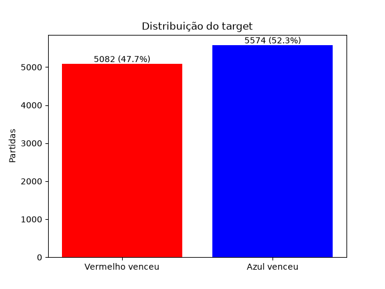
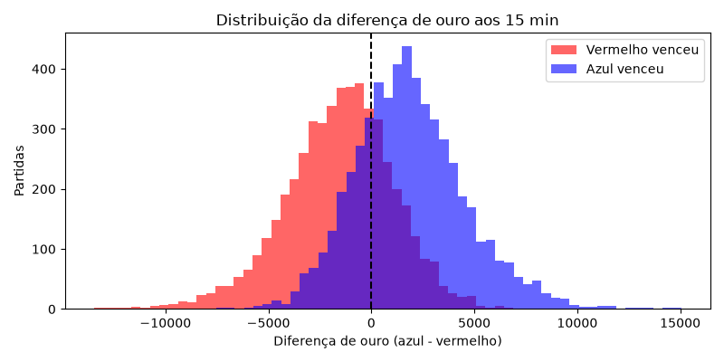
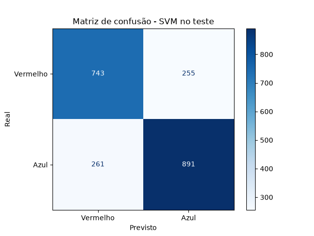

# ML_treino_eSports

Modelo SVC com GridSearchCV para prever o vencedor de partidas profissionais de League of Legends (campeonatos de 2022: LCK, LEC, LCS, CBLOL, MSI, Worlds...) usando as estatísticas do jogo aos 15 minutos.

**Dataset:** Oracle's Elixir 2022 ([Kaggle: LoL E-sports 2022](https://www.kaggle.com/datasets/arthur1511/lol-esports-2022))

## Estrutura
```
data/
  2022_LoL_esports_match_data_from_OraclesElixir.csv   dataset original (150.588 linhas)
  partidas_tratadas.csv                                 dados depois da limpeza (1 linha por partida)
figures/                                                gráficos gerados
models/
  svc_lol_esports.joblib                                modelo treinado
  grid_results.csv                                      resultado de cada combinação do grid
train_svc.py                                            código completo
```

## Como rodar
```bash
pip install -r requirements.txt
python train_svc.py
```

## Tratamento dos dados
- **1 linha por partida:** o dataset tem 12 linhas por jogo (10 jogadores + 2 times). Usei só a linha do time azul.
- **Nulos:** os jogos `partial` não têm dados de 10/15 min (100% nulo), então foram removidos.
- **Features (8):** diferença azul - vermelho de ouro, XP, CS e abates aos 10 e 15 min. Todas numéricas, então não precisou de encode.
- **Normalização:** StandardScaler, porque o SVM usa distância.
- **Treino/teste:** separado por data (jogos antigos no treino, jogos novos no teste).

## Resultado
- Melhores parâmetros: kernel linear, C=0.1
- Acurácia no treino: 74,7%
- Acurácia no teste: 76,0%
- Treino e teste próximos, então não teve overfitting.

## Gráficos
1. **Distribuição do target:** 52% vitórias do azul e 48% do vermelho, as classes estão equilibradas.


2. **Distribuição da diferença de ouro aos 15 min:** quando o azul vence, a diferença fica positiva, e quando perde, fica negativa. A parte em que as cores se misturam são os jogos parelhos.


3. **Matriz de confusão:** 1.634 acertos em 2.150 partidas de teste. Os erros estão parecidos nos dois lados (255 e 261).

