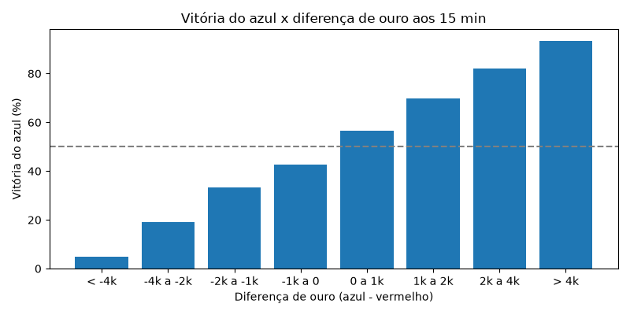
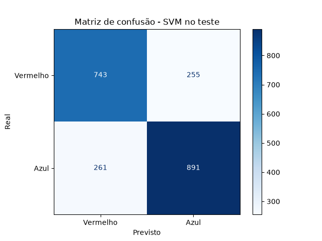

# ML_treino_eSports

Modelo SVC com GridSearchCV para prever o vencedor de partidas profissionais de League of Legends (campeonatos de 2022: LCK, LEC, LCS, CBLOL, MSI, Worlds...) usando as estatísticas do jogo aos 15 minutos.

**Dataset:** Oracle's Elixir 2022 ([Kaggle: LoL E-sports 2022](https://www.kaggle.com/datasets/arthur1511/lol-esports-2022))

## Estrutura
```
data/
  2022_LoL_esports_match_data_from_OraclesElixir.csv   dataset original (150.588 linhas)
  partidas_tratadas.csv                                 dados depois da limpeza (1 linha por partida)
figures/                                                gráficos gerados
models/
  svc_lol_esports.joblib                                modelo treinado
  grid_results.csv                                      resultado de cada combinação do grid
train_svc.py                                            código completo
```

## Como rodar
```bash
pip install -r requirements.txt
python train_svc.py
```

## Tratamento dos dados
- **1 linha por partida:** o dataset tem 12 linhas por jogo (10 jogadores + 2 times). Usei só a linha do time azul.
- **Nulos:** os jogos `partial` (1.893, principalmente das ligas chinesas LPL e LDL) têm 100% de nulo nas stats de 10/15 min e foram removidos. Os jogos `complete` têm 0 nulos.
- **Features (8):** diferença azul - vermelho de ouro, XP, CS e abates aos 10 e 15 min. Só numéricas, então não precisou de encode.
- **Sem vazamento:** só uso colunas medidas exatamente aos 10 e 15 min. Deixei de fora first blood, primeiro dragão e primeiro arauto porque o dataset não diz quando aconteceram (em 90 partidas o first blood foi depois dos 15 min). Também não uso stats de fim de jogo (torres, barão, ouro final).
- **Normalização:** StandardScaler dentro do Pipeline (o SVM usa distância).
- **Treino/teste:** separado por data (treino antes de 10/08/2022, teste depois), sem dividir séries MD3/MD5.

## Resultado
| | Acurácia no teste |
|---|---|
| Chute (sempre azul) | 53,6% |
| Regra do ouro (quem tem mais ouro aos 15 min vence) | 76,1% |
| **SVM (linear, C=0.1)** | **76,0%** |

- Validação cruzada: 74,6% | Treino: 74,7% | Teste: 76,0%. O treino não ficou acima do teste, então não há overfitting.
- O teste ficou um pouco acima do treino porque é o fim da temporada (playoffs e mundial), com jogos um pouco mais previsíveis. O esperado para jogos novos é entre 75% e 76%.
- O SVM empata com a regra do ouro: a diferença de ouro aos 15 min é o fator que mais decide a partida, e o SVM aprendeu isso usando as 8 features.

## Gráficos
1. **Distribuição do target:** 52,3% vitórias do azul e 47,7% do vermelho. As classes estão equilibradas, então não precisa balancear.


2. **Distribuição da diferença de ouro aos 15 min:** quando o azul vence, a diferença fica mais para a direita (positiva), e quando perde, mais para a esquerda. A parte em que as cores se misturam são os jogos parelhos, onde o modelo mais erra.


3. **Vitória x diferença de ouro:** quanto mais ouro de vantagem, mais o time vence. É a relação principal que o SVM aprende.


4. **Matriz de confusão (SVM no teste):** 1.634 acertos em 2.150 partidas (76,0%). Os erros estão parecidos nos dois lados (255 e 261), então o modelo não favorece nenhum time.

