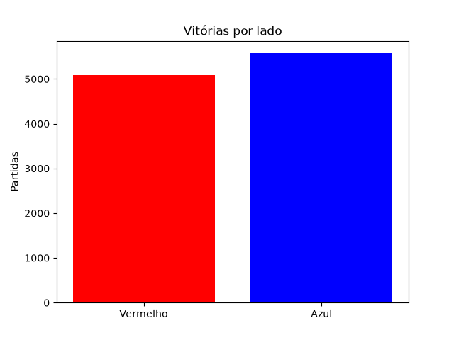
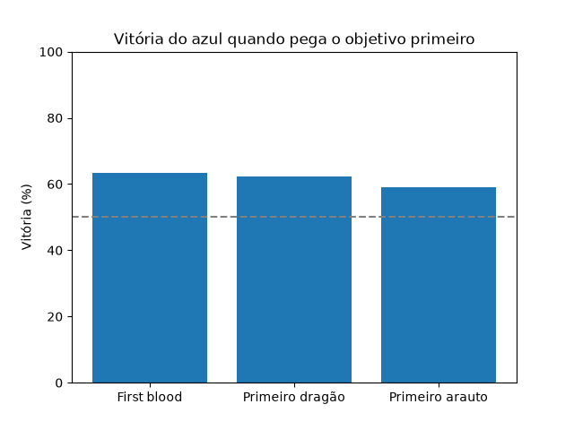

# ML_treino_eSports

Modelo SVC com GridSearchCV para prever o vencedor de partidas profissionais de League of Legends (campeonatos de 2022: LCK, LEC, LCS, CBLOL, MSI, Worlds...) usando as estatísticas do jogo aos 15 minutos.

**Dataset:** Oracle's Elixir 2022 ([Kaggle: LoL E-sports 2022](https://www.kaggle.com/datasets/arthur1511/lol-esports-2022))

## Estrutura
```
data/
  2022_LoL_esports_match_data_from_OraclesElixir.csv   dataset original (150.588 linhas)
  partidas_tratadas.csv                                 dados depois da limpeza (1 linha por partida)
figures/                                                gráficos gerados
models/
  svc_lol_esports.joblib                                modelo treinado
  grid_results.csv                                      resultado de cada combinação do grid
train_svc.py                                            código completo
```

## Como rodar
```bash
pip install -r requirements.txt
python train_svc.py
```

## Tratamento dos dados
- **1 linha por partida:** o dataset tem 12 linhas por jogo (10 jogadores + 2 times). Usei só a linha do time azul.
- **Nulos:** os jogos `partial` (1.893) têm 100% de nulo nas stats de 10/15 min e foram removidos. Os jogos `complete` têm 0 nulos.
- **Categóricas:** só usei colunas numéricas, então não precisou de encode.
- **Normalização:** StandardScaler, dentro do Pipeline.
- **Sem vazamento:** não usei stats de fim de jogo (torres, barão, ouro total), só dados até os 15 min.
- **Treino/teste:** separado por data (treino antes de 10/08/2022, teste depois), sem dividir séries MD3/MD5.

## Resultado
| | Acurácia |
|---|---|
| Treino | 74,8% |
| Validação cruzada (5 folds) | 74,6% |
| **Teste** | **77,0%** |

Melhores parâmetros: `kernel=linear, C=0.01`. Treino e teste ficaram próximos, então não teve overfitting.

## Gráficos
Os gráficos 1 a 3 vêm dos dados (partidas reais). O 4 vem do modelo.

1. **Vitórias por lado:** o azul vence 52,3% das partidas, então as classes estão equilibradas.


2. **Vitória x diferença de ouro aos 15 min:** quanto maior a vantagem de ouro, maior a chance de vencer. Com mais de 4k de vantagem, o azul vence mais de 90% das vezes.


3. **Vitória de quem pega o objetivo primeiro:** first blood 63%, primeiro dragão 62%, primeiro arauto 59%.


4. **Matriz de confusão (SVM no teste):** 1.656 acertos em 2.150 partidas (77,0%).

